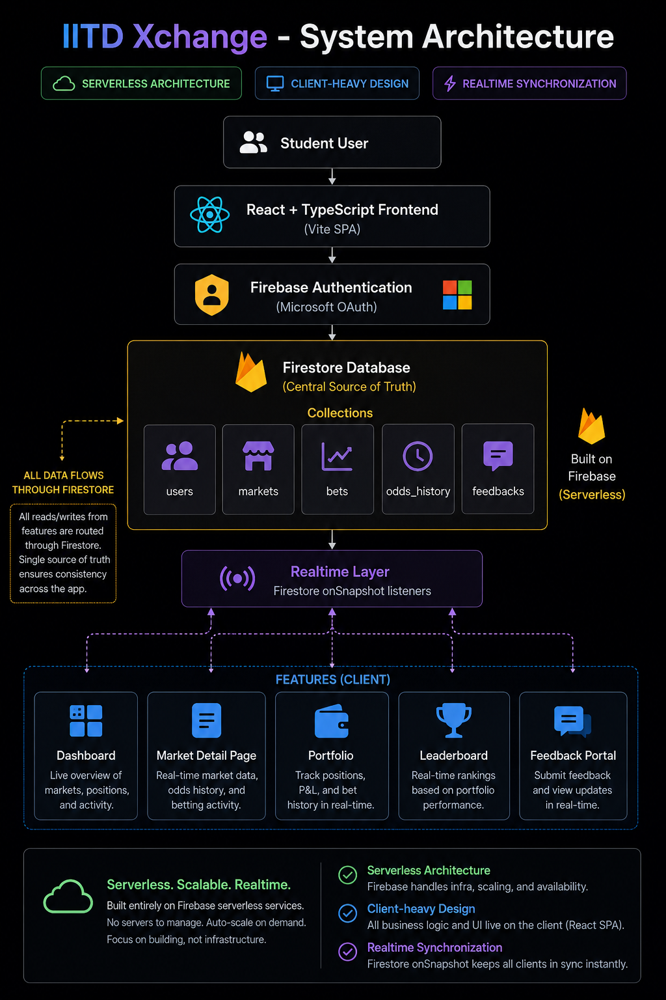

# IITD Xchange

IITD Xchange is a campus prediction market I built for IIT Delhi election season.

People could log in with their IITD Microsoft account, trade virtual tokens on binary outcomes, track their portfolio, and watch odds update live as other people placed predictions.

I built the app quickly, launched it to real users, and now I’m keeping it here as a public archive of the project.

## What the app does

- Sign in with Microsoft OAuth
- Give each user a starting virtual balance
- Let users place predictions on live markets
- Show changing odds based on how the pool shifts
- Track open positions and portfolio value
- Rank users on a live leaderboard
- Let admins create, edit, resolve, reopen, or delete markets
- Collect user feedback directly in the app

## Screenshots

### Login


### Markets


### Leaderboard


### Portfolio


### Feedback


## How it works

The frontend is a React app built with Vite. I used Firebase for authentication, database reads and writes, and realtime updates.

At a high level, the flow looks like this:

```text
User
  → React frontend
  → Firebase Auth (Microsoft)
  → Firestore
  → Live market / portfolio / leaderboard updates
```

## Architecture



## Tech stack

- React + TypeScript
- Vite
- Firebase Auth
- Firestore
- Firebase Hosting
- Framer Motion
- Recharts

## Project structure

```text
.
├── README.md
├── learnings.md
├── LICENSE
├── .env.example
├── screenshots/
├── flow/
├── frontend/
└── firebase/
```

## Lessons Learned & Post-Mortem

I wrote down an honest post-mortem reflection about the technical choices, mistakes, and operational compromises made during the project. You can read the full write-up in [learnings.md](learnings.md).

### Quick Summary:
- **What went right:** Launching during campus election season drove instant virality. Microsoft OAuth restricted access to verified students, and the mobile-first design felt premium.
- **Mistakes made:** Core trading calculations and settlements ran entirely on the client, admin control lists were hardcoded in the frontend, and the real-time leaderboard listened to the entire database, leading to massive Firestore read bills.
- **If I built V2:** I would offload math/settlement to a backend (or Cloud Functions), pre-compute leaderboards asynchronously, and implement proper AMM pricing instead of flat pari-mutuel payouts.

## Running locally

1. Copy `.env.example` to `.env` in the repo root.
2. Add your Firebase web app config values.
3. Add any admin emails to `VITE_ADMIN_EMAILS` if you want admin controls.
4. Start the frontend:

```bash
cd frontend
npm install
npm run dev
```

By default the app opens in archive mode and shows a black screen.

If you want to run the actual product UI locally, set:

```bash
VITE_ARCHIVE_MODE=false
```

in the root `.env` file.

## Notes

- Most of the product logic lives in the frontend.
- Firestore is used for users, markets, bets, odds history, and feedback.
- This repo is mainly here to preserve the project safely for public viewing, not as an active production deployment.
# iitd_xchange
